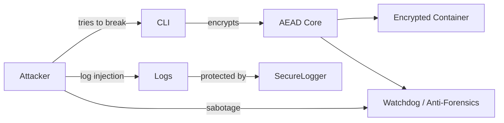

# Zilant Prime Core

[](https://codecov.io/gh/QuantumKeyUYU/zilant-prime-core)
[](https://github.com/QuantumKeyUYU/zilant-prime-core/security)
[](./docs/ARCH.md)

[](./secret_leak_report.md)
[](./CHANGELOG_AUTO.md)
[](./licenses_report.md)
[](https://github.com/QuantumKeyUYU/zilant-prime-core/actions/workflows/security-compliance-suite.yml)
[](https://github.com/QuantumKeyUYU/zilant-prime-core/actions/workflows/crypto-threat-model.yml)
[](https://github.com/QuantumKeyUYU/zilant-prime-core/actions/workflows/policy-enforcement.yml)
[](https://github.com/QuantumKeyUYU/zilant-prime-core/actions/workflows/quality.yml)
[](https://github.com/QuantumKeyUYU/zilant-prime-core/actions/workflows/sbom.yml)
[](https://github.com/QuantumKeyUYU/zilant-prime-core/actions/workflows/ci.yml)

Универсальная CLI и библиотека для безопасных контейнеров, шифрования логов, VDF‑доказательств и строгой DevSecOps‑цепочки вокруг криптосреды.



---

## Status / Stages

### Stage 0: Secure Logging ✅ (завершено)

Компонент **SecureLogger**:

- Пишет зашифрованные AES‑GCM записи в журнал и корректно их расшифровывает.
- Защищает от log‑injection: ASCII‑whitelist + экранирование `\n`, `\r`.
- Использует singleton‑инициализацию через `get_secure_logger()`.
- Полный набор тестов (100 % по модулю):
  - сериализация / десериализация (`test_secure_logging*.py`);
  - обработка битых строк и некорректного JSON;
  - дополнительные поля, валидация типа ключа;
  - сценарии tampering и пропуска строк.
- SPDX‑хедеры проставлены в исходниках.

**Чеклист Stage 0**

- ✅ `SecureLogger` с AES‑GCM и `read_logs()`.
- ✅ Обработка отсутствия файла, некорректного base64 / JSON.
- ✅ Экранирование небезопасных символов.
- ✅ Singleton‑логгер (`get_secure_logger`).
- ✅ Тесты на все ветки.
- ✅ Обновлённый README со статусом Stage 0.

---

### Stage 1: Quantum‑Pseudo‑HSM 🛠 (в работе)

Базовые кирпичики офлайн‑слоя Pseudo‑HSM:

- `device_fp.py` — собирает характеристики железа и строит детерминированный fingerprint устройства.
- `shard_secret.py` — XOR‑шардинг секрета.
- `counter.py` — монотонный счётчик в файле.
- `anti_snapshot.py` — lock‑файл для детекта снапшотов / откатов.

CLI использует эти примитивы на старте, закладывая основу для полноценного Pseudo‑HSM‑режима.

---

## Документация

- 🔐 Threat Model: [`docs/THREATS.md`](docs/THREATS.md)
- 🏗 Architecture: [`docs/ARCH.md`](docs/ARCH.md)
- 🛡 Security Policy: [`SECURITY.md`](SECURITY.md)

---

## Установка

```bash
pip install zilant-prime-core

# опционально: автодополнение
source completions/zilant.bash   # bash
# или
source completions/zilant.zsh    # zsh
```

Локальная разработка:

```bash
git clone https://github.com/QuantumKeyUYU/zilant-prime-core.git
cd zilant-prime-core

py -m venv .venv      # Windows
.\.venv\Scripts\Activate.ps1

python -m pip install --upgrade pip
pip install -e .[dev]

pytest -q -k "not semgrep"   # быстрый прогон без тяжелых проверок
```

---

## Quickstart: CLI контейнеры

```bash
# Базовое шифрование файла
zilctl pack secret.txt secret.zil

# С генерацией фейковых данных и метаданных
zilctl pack secret.txt --fake-metadata --decoy 2 -p mypass

# Через HashiCorp Vault (поле `password`)
export VAULT_ADDR="https://vault.example.com"
export VAULT_TOKEN="s.1a2b3c4d"
zilctl pack secret.txt --vault-path secret/data/zilant/password

# Распаковка
zilctl unpack secret.zil --output-dir ./out

# Honeypot‑режим (выдаст приманку при ошибке пароля)
zilctl unpack secret.zil -p wrong --honeypot-test
```

Пример сравнения метаданных настоящего и фейкового контейнера:

```bash
zilctl uyi show-metadata secret.zil
zilctl uyi show-metadata decoy_abcd.zil
```

---

## Anti‑Forensics & Реальные атаки

Decoy‑контейнеры помогают уводить судебных аналитиков в сторону.

- `--decoy` и `--decoy-expire` создают приманки, которые исчезают через заданный интервал.
- При неверном пароле в honeypot‑режиме возвращается decoy и пишется событие `decoy_event`.
- Если приманка исчезла до срока — в audit‑ledger попадает `decoy_removed_early`.
- При уборке (авто или ручной) фиксируется `decoy_purged`.

Ручная уборка протухших приманок:

```bash
zilctl --decoy-sweep
zilctl --decoy-sweep --paranoid   # печатает, сколько decoy удалено
```

Возможные атаки и ожидаемое поведение:

| Атака                              | Результат                                                                       |
|------------------------------------|----------------------------------------------------------------------------------|
| Неверный пароль в honeypot‑режиме | Создаётся decoy‑контейнер, журналирует `decoy_event`                           |
| Повреждение контейнера             | Ошибка целостности, данные не раскрываются                                      |
| Массовый перебор паролей           | Счётчик `get_open_attempts` отражает все попытки, можно триггерить блокировку   |

---

## Shamir Secret Sharing

Разделите мастер‑ключ на части и восстановите его при необходимости:

```bash
zilctl key shard export --master-key cosign.key \
    --threshold 3 --shares 5 --output-dir shards

# храните файлы shards/share*.hex и shards/meta.json в разных безопасных местах

zilctl key shard import --input-dir shards --output-file master.key
```

Храните шард‑бэкапы на отдельных офлайн‑носителях. Для восстановления
достаточно собрать `threshold` частей в одной директории и выполнить
команду `shard import`.

---

## Stream Verification

Проверить целостность большого контейнера без распаковки:

```bash
zilctl stream verify big.zst --key master.key
```

Проверить заголовок контейнера без распаковки:

```bash
zilctl uyi verify-integrity secret.zil
zilctl uyi show-metadata secret.zil
```

Изменение хотя бы одного байта приводит к ошибке «MAC mismatch».

---

## HPKE Encryption

Гибридное шифрование (Kyber768 + X25519) доступно через подкоманды `hpke`:

```bash
zilctl hpke encrypt src.bin ct.bin --pq-pub kyber.pk --x-pub x25519.pk
zilctl hpke decrypt ct.bin out.bin --pq-sk kyber.sk --x-sk x25519.sk
```

---

## Root Baseline

Zilant Prime Core по умолчанию **прерывает выполнение**, если замечены признаки root / отладки.

Проверки выполняются при импортe:

- UID или GID равен нулю.
- Найдены типичные пути `su` / Magisk.
- Root‑файловая система смонтирована как writable.
- SELinux выключен или в permissive‑режиме.
- В `/proc/self/status` виден активный tracer.

Если что‑то из этого срабатывает, процесс завершается с кодом `99`.

Байпас для тестов:

```bash
export ZILANT_ALLOW_ROOT=1
python -c "import zilant_prime_core"
```

`harden_linux()` ничего не печатает при успехе. Можно вызвать явно:

```bash
python - <<'EOF'
import zilant_prime_core

zilant_prime_core.harden_linux()
print("hardened")
EOF
```

---

## Migration guide (PQ‑crypto)

```python
from zilant_prime_core.utils import pq_crypto

kem = pq_crypto.HybridKEM()
pk_pq, sk_pq, pk_x, sk_x = kem.generate_keypair()
ct_pq, _ss_pq, epk, _ss_x, shared = kem.encapsulate((pk_pq, pk_x))
ss = kem.decapsulate((sk_pq, sk_x), (ct_pq, epk, b""))
```

CLI‑регистрация и логин через OPAQUE:

```bash
zilctl register --server https://auth.example --username alice
zilctl login --server https://auth.example --username alice
```

---

## Development

### Code Owners & Static Analysis

- Исходники и тесты: `@QuantumKeyUYU`
- Документация: `@DocMaintainers`
- CI / DevSecOps‑пайплайны: `@DevSecOpsTeam`

Каждый PR прогоняет:

- `ruff`, `black`, `mypy`, `pytest`;
- Semgrep с кастомными правилами (`.semgrep/`);
- SBOM‑генерацию и отчёты по лицензиям;
- crypto‑threat‑модель и policy‑enforcement workflows.

---

## Security Checks

- Единый отчёт по соответствию: `security_compliance_report.md`
- Автоматизированный крипто‑анализ: `crypto_threat_report.md`
- Политики и нарушения: `policy_report.md`

---

## Roadmap / TODO Stage III

- GUI‑демо (PyQt / Web UI).
- Расширенная bug‑bounty‑политика и доработка `SECURITY.md`.
- Docker‑образ с безопасным entrypoint:

  ```bash
  docker run --rm ghcr.io/quantumkeyuyu/zilant-prime-core \
      python -c "import zilant_prime_core; zilant_prime_core.harden_linux()"
  ```
