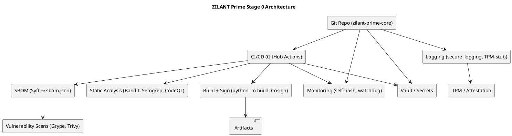

# ARCH.md

```plantuml
@startuml
title ZILANT Prime Stage 0 Architecture

rectangle "Git Repo (zilant-prime-core)" as Repo
rectangle "CI/CD (GitHub Actions)" as CI
rectangle "SBOM (Syft → sbom.json)" as Syft
rectangle "Vulnerability Scans (Grype, Trivy)" as Vuln
rectangle "Static Analysis (Bandit, Semgrep, CodeQL)" as Static
rectangle "Build + Sign (python –m build, Cosign)" as BuildSign
rectangle "Monitoring (self-hash, watchdog)" as Monitor
rectangle "Logging (secure_logging, TPM-stub)" as Logging
rectangle "Vault / Secrets" as Vault
rectangle "TPM / Attestation" as TPM

Repo --> CI
CI --> Syft
Syft --> Vuln
CI --> Static
CI --> BuildSign
BuildSign --> [Artifacts]
Repo --> Logging
Logging --> TPM
Repo --> Vault
CI --> Vault
Repo --> Monitor
CI --> Monitor
@enduml
```
