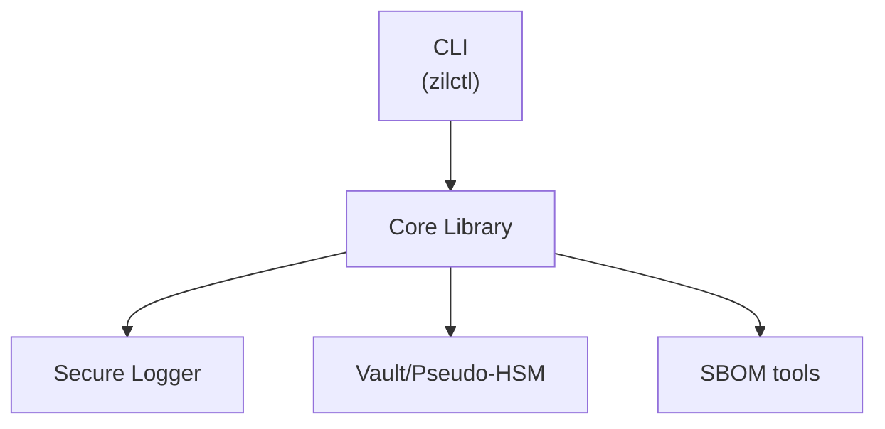

# SPDX-License-Identifier: MIT
# SPDX-FileCopyrightText: 2025 Zilant Prime Core Contributors

# Architecture Overview

- **CLI** – user facing commands.
- **Core Library** – cryptography and container logic.
- **Secure Logger** – encrypts audit logs with AES‑GCM.
- **Vault/Pseudo‑HSM** – secrets storage.
- **SBOM tools** – reproducible builds and vulnerability scanning.
