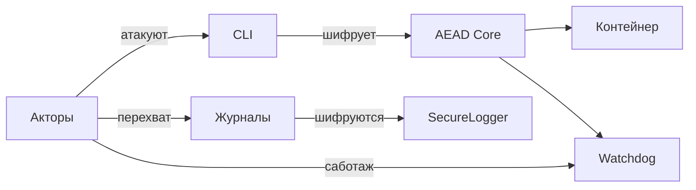

# SPDX-License-Identifier: MIT
# SPDX-FileCopyrightText: 2025 Zilant Prime Core Contributors

# Threat Model

## Adversaries

- **A1 – Insider developer**: contributor with repository access who may inject malicious code.
- **A2 – Compromised CI/CD**: attacker gaining control over the automation pipeline.
- **A3 – Stolen credentials**: leaked Vault or cosign keys used outside the organisation.
- **A4 – Malicious dependency**: third‑party package or tool shipping vulnerable code.
- **A5 – Tampering user**: someone modifying artefacts or logs after build.

## Security objectives

- **C1 – Code integrity**: prevent unauthorised changes to the source.
- **C2 – Confidentiality of secrets**: keep Vault tokens and keys encrypted.
- **C3 – Traceability**: preserve audit logs of every build step.
- **C4 – Reproducibility**: anyone can rebuild identical artefacts from the same tag.
- **C5 – Vulnerability free**: ship images that pass SBOM scanning.

## Asset / Threat / Control

| Asset | Threat | Control |
|-------|--------|---------|
| Source code | A1, A2 | signed commits, CI lint & tests |
| Secrets | A3 | Vault AppRole, encrypted logs |
| Dependencies | A4 | SBOM with grype scans |
| Artefacts | A5 | reproducible build, cosign signatures |
| Logs | A5 | AES‑GCM secure logger |

### Pseudo-HSM Threat Model

- **Replay-атака**: злоумышленник копирует старый `lock.json` или `counter.txt` и пытается повторно применить их, чтобы вернуть систему в прошлое состояние.
- **Откат состояния**: манипуляции с файловой системой (snapshots) и попытки обойти `anti_snapshot.py` для возвращения содержимого в более ранний момент времени.
- **Подмена шардов**: изменение или удаление файлов `shard_*.hex` до выполнения `unseal`, что делает восстановление ключа неверным или невозможным.
- **Атака «грубая сила»**: подбор меньшего числа шардов, чем заданный `threshold`, чтобы получить доступ к мастер‑ключу.
- **Компрометация master-key**: кража временного файла `master.key` до разделения на шары и его последующая утечка.
