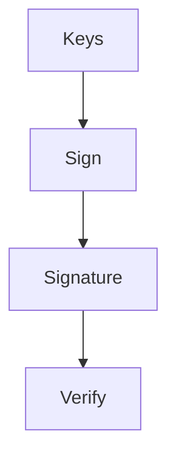

# PQ Ring Signatures

This guide explains how to generate and verify post-quantum ring signatures.

```bash
# Generate a key pair for the ring
python -m zilant_prime_core.utils.pq_ring generate-key --out keys.json
```

```bash
# Sign a message using the private key
python -m zilant_prime_core.utils.pq_ring sign \
    --key keys.json --message msg.txt --output signature.bin
```

```bash
# Verify the ring signature
python -m zilant_prime_core.utils.pq_ring verify \
    --key keys.json --message msg.txt --signature signature.bin
```


