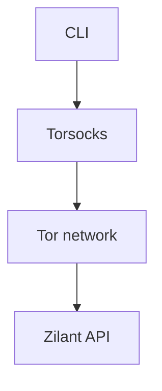

# Using Tor Proxy

This guide shows how to run the CLI through Tor.

```bash
# Install torsocks if not already present
sudo apt-get install torsocks
```

```bash
# Run the CLI with torsocks so all network traffic goes through Tor
TORSOCKS_LOG_LEVEL=notice torsocks zilant-cli --help
```


